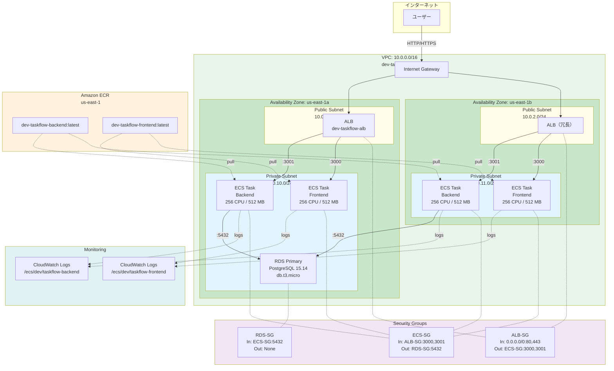
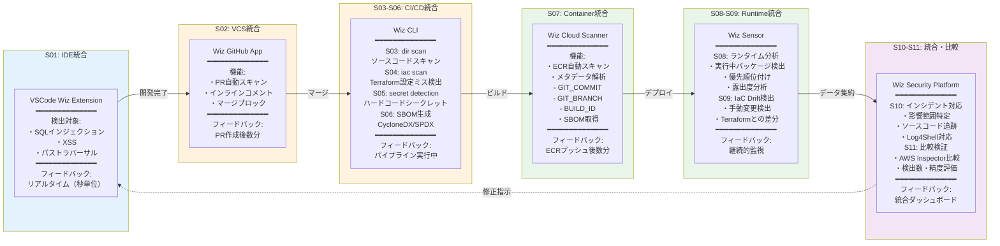

# Wiz Code検証プロジェクト アーキテクチャ

## 概要

本ドキュメントでは、Wiz Code検証プロジェクトの技術アーキテクチャと、検証対象となるTaskFlowアプリケーションの構成を説明します。

このプロジェクトは、Wizセキュリティプラットフォームの完全なライフサイクル（開発 → VCS → CI/CD → Container Registry → Deploy → Runtime）におけるセキュリティ機能を包括的に検証します。

---

## アーキテクチャ図

### 図1: 全体フロー図 - 開発からランタイムまでの完全なライフサイクル

```mermaid
flowchart TB
    subgraph dev["開発環境層（S01）"]
        style dev fill:#E3F2FD
        vscode["VSCode + Wiz Extension<br/>リアルタイムスキャン<br/>インラインフィードバック"]
    end

    subgraph vcs["VCS層（S02）"]
        style vcs fill:#FFF3E0
        github["GitHub Repository<br/>ソースコード管理"]
        wizapp["Wiz GitHub App<br/>PRスキャン・マージブロック"]
    end

    subgraph cicd["CI/CD層（S03, S04, S05, S06）"]
        style cicd fill:#FFF3E0
        actions["GitHub Actions<br/>ワークフロー実行"]
        wizcli["Wiz CLI<br/>・ソースコードスキャン（S03）<br/>・IaCスキャン（S04）<br/>・シークレット検出（S05）<br/>・SBOM生成（S06）"]
        sarif["SARIF/JSON<br/>スキャン結果出力"]
    end

    subgraph registry["Container Registry層（S07）"]
        style registry fill:#E8F5E9
        ecr["Amazon ECR<br/>dev-taskflow-backend<br/>dev-taskflow-frontend"]
        wizcloud["Wiz Cloud Scanner<br/>・自動イメージスキャン<br/>・メタデータ解析<br/>・SBOM取得"]
    end

    subgraph deploy["Deploy層（S07）"]
        style deploy fill:#E8F5E9
        alb["Application Load Balancer<br/>dev-taskflow-alb"]
        ecs_be["ECS Fargate Service<br/>Backend (3001)"]
        ecs_fe["ECS Fargate Service<br/>Frontend (3000)"]
        rds["RDS PostgreSQL 15.14<br/>db.t3.micro"]
    end

    subgraph runtime["Runtime層（S08, S09）"]
        style runtime fill:#E8F5E9
        sensor["Wiz Sensor<br/>・実行中パッケージ検出<br/>・優先順位付け（S08）<br/>・IaC Drift検出（S09）"]
    end

    subgraph wizplatform["Wiz Security Platform（S10, S11）"]
        style wizplatform fill:#F3E5F5
        graph["Wiz Security Graph<br/>Code-to-Cloudトレーサビリティ"]
        incident["インシデント対応<br/>Log4Shell対応フロー（S10）"]
        compare["比較検証<br/>AWS Inspector vs Wiz（S11）"]
    end

    %% Forward Flow
    vscode -->|git push| github
    github -->|PR作成| wizapp
    wizapp -->|スキャン結果| github
    github -->|マージ| actions
    actions -->|実行| wizcli
    wizcli -->|出力| sarif
    sarif -->|アップロード| github
    actions -->|Docker build<br/>メタデータ付与| ecr
    ecr -->|スキャン| wizcloud
    ecr -->|pull| ecs_be
    ecr -->|pull| ecs_fe
    alb -->|ルーティング| ecs_be
    alb -->|ルーティング| ecs_fe
    ecs_be -->|接続| rds
    ecs_be -->|監視| sensor
    ecs_fe -->|監視| sensor

    %% Data Flow to Wiz Platform
    wizcli -.->|スキャン結果| graph
    wizcloud -.->|イメージ情報| graph
    sensor -.->|ランタイムデータ| graph
    graph -->|統合分析| incident
    graph -->|比較データ| compare

    %% Backward Traceability
    sensor -.->|逆追跡| ecr
    ecr -.->|Build ID| actions
    actions -.->|Commit SHA| github

    classDef vulnClass fill:#FFEBEE,stroke:#C62828
```

#### 図の説明

この図は、Wiz Code検証プロジェクトの完全なセキュリティライフサイクルを示しています。開発者がコードを書く段階から、本番ランタイム環境まで、Wizがどのように統合されているかを視覚化しています。

#### 主要な統合ポイント（シナリオS01-S11マッピング）

| 層 | シナリオ | Wiz機能 | フィードバック速度 |
|---|---------|---------|------------------|
| 開発環境 | S01 | VSCode Wiz Extension | リアルタイム（秒単位） |
| VCS | S02 | Wiz GitHub App | PR作成後数分 |
| CI/CD | S03-S06 | Wiz CLI（コード・IaC・シークレット・SBOM） | パイプライン実行中（数分〜十数分） |
| Container Registry | S07 | Wiz Cloud Scanner | ECRプッシュ後数分 |
| Runtime | S08-S09 | Wiz Sensor | 継続的監視 |
| Security Platform | S10-S11 | Wiz Security Graph | 統合分析・比較検証 |

#### データフロー

1. **Forward Flow（開発 → デプロイ）**: 開発者のコード変更 → GitHub → CI/CD → ECR → ECS
2. **Security Data Flow**: 各段階のスキャン結果 → Wiz Security Graph
3. **Backward Traceability**: Runtime脆弱性 → ECR Image → Build ID → Source Code

---

### 図2: AWS インフラ詳細図 - ネットワーク、セキュリティ、リソース配置



#### 図の説明

この図は、Terraformで構築されるAWSインフラの詳細を示しています。Multi-AZ構成でECS Fargateタスクを実行し、ALBで負荷分散、RDS PostgreSQLでデータを管理する構成です。

#### VPC構成詳細

| リソース | CIDR / 値 | 説明 |
|---------|-----------|------|
| VPC | 10.0.0.0/16 | dev-taskflow-vpc |
| Public Subnet 1 | 10.0.1.0/24 | us-east-1a、ALB配置 |
| Public Subnet 2 | 10.0.2.0/24 | us-east-1b、ALB配置 |
| Private Subnet 1 | 10.0.10.0/24 | us-east-1a、ECS/RDS配置 |
| Private Subnet 2 | 10.0.11.0/24 | us-east-1b、ECS配置 |

#### セキュリティグループルール

| SG名 | Inbound | Outbound |
|------|---------|----------|
| ALB-SG | 0.0.0.0/0:80, 0.0.0.0/0:443 | ECS-SG:3000, ECS-SG:3001 |
| ECS-SG | ALB-SG:3000, ALB-SG:3001 | RDS-SG:5432, 0.0.0.0/0:443 |
| RDS-SG | ECS-SG:5432 | なし |

#### リソース配置

- **ALB**: Public Subnetに配置、インターネットからアクセス可能
- **ECS Tasks**: Private Subnetに配置、ALB経由のみアクセス可能
- **RDS**: Private Subnetに配置、ECS Tasks からのみアクセス可能
- **ECR**: リージョナルサービス、すべてのAZからアクセス可能

---

### 図3: Wiz統合ポイント図 - 各段階でのWiz機能マッピング



#### 図の説明

この図は、開発ライフサイクルの各段階でWiz機能がどのように統合され、フィードバックループを形成するかを示しています。

#### 統合ポイント一覧

| シナリオ | Wiz機能 | 検出対象 | フィードバック速度 |
|---------|---------|---------|------------------|
| **S01** | VSCode Wiz Extension | SQLインジェクション、XSS、パストラバーサル | リアルタイム（秒単位） |
| **S02** | Wiz GitHub App | コード脆弱性、シークレット | PR作成後数分 |
| **S03** | Wiz CLI (dir scan) | ソースコード脆弱性 | CI/CD実行中（5-10分） |
| **S04** | Wiz CLI (iac scan) | IaC設定ミス（RDS公開、暗号化なし等） | CI/CD実行中（5-10分） |
| **S05** | Wiz CLI (secret detection) | ハードコードされたAWS Key、DB Password | CI/CD実行中（5-10分） |
| **S06** | Wiz CLI (SBOM) | 依存関係、既知の脆弱性 | CI/CD実行中（5-10分） |
| **S07** | Wiz Cloud Scanner | コンテナイメージ、メタデータ解析 | ECRプッシュ後数分 |
| **S08** | Wiz Sensor | 実行中パッケージ、優先順位付け | 継続的監視 |
| **S09** | Wiz Cloud | IaC Drift検出 | 継続的監視 |
| **S10** | Wiz Security Graph | インシデント影響範囲特定 | リアルタイム |
| **S11** | Wiz vs AWS Inspector | 検出能力比較 | 検証時 |

#### フィードバックループ

1. **リアルタイムフィードバック（S01）**: 開発中に即座に問題を特定し修正
2. **PRレビューフィードバック（S02）**: コミット前に問題をブロック
3. **CI/CDフィードバック（S03-S06）**: ビルド時に包括的なスキャン
4. **ランタイムフィードバック（S08-S09）**: 本番環境での継続的監視
5. **統合フィードバック（S10）**: すべての情報を統合し迅速なインシデント対応

---

### 図4: Code-to-Cloudトレーサビリティ図 - メタデータフローと逆追跡パス

```mermaid
flowchart TB
    subgraph dev_phase["開発フェーズ"]
        style dev_phase fill:#E3F2FD
        developer["開発者<br/>コード変更"]
        commit["GitHub Commit<br/>SHA: abc123def456"]
    end

    subgraph ci_phase["CI/CDフェーズ"]
        style ci_phase fill:#FFF3E0
        trigger["GitHub Actions<br/>トリガー"]
        build["Docker Build<br/>━━━━━━━━━━━━━━<br/>メタデータ付与:<br/>・GIT_COMMIT: abc123<br/>・GIT_BRANCH: main<br/>・BUILD_DATE: 2024-11-28<br/>・BUILD_ID: 12345<br/>・REPO: org/taskflow"]
        wizscan["Wiz CLI<br/>━━━━━━━━━━━━━━<br/>Wizタグ付与:<br/>・component: backend<br/>・environment: dev<br/>・branch: main<br/>・commit: abc123"]
    end

    subgraph registry_phase["Registry フェーズ"]
        style registry_phase fill:#E8F5E9
        ecr["Amazon ECR<br/>━━━━━━━━━━━━━━<br/>Image:<br/>dev-taskflow-backend:abc123<br/>━━━━━━━━━━━━━━<br/>Metadata:<br/>すべてのGit情報保持"]
        wizcloud["Wiz Cloud<br/>━━━━━━━━━━━━━━<br/>スキャン:<br/>・メタデータ抽出<br/>・SBOM生成<br/>・脆弱性検出"]
    end

    subgraph runtime_phase["Runtimeフェーズ"]
        style runtime_phase fill:#E8F5E9
        ecs["ECS Task<br/>━━━━━━━━━━━━━━<br/>Task ARN:<br/>arn:aws:ecs:...:task/abc<br/>━━━━━━━━━━━━━━<br/>実行中パッケージ:<br/>・express@4.17.1<br/>・pg@8.7.1"]
        sensor["Wiz Sensor<br/>━━━━━━━━━━━━━━<br/>検出:<br/>・実行中パッケージ<br/>・ネットワーク露出<br/>・権限分析"]
    end

    subgraph security_graph["Wiz Security Graph"]
        style security_graph fill:#F3E5F5
        link["Code-to-Cloud<br/>トレーサビリティ<br/>━━━━━━━━━━━━━━<br/>リンク確立:<br/>ECS Task ↔ ECR Image<br/>ECR Image ↔ Build ID<br/>Build ID ↔ Commit SHA<br/>Commit SHA ↔ Source Code"]
    end

    subgraph incident["S10: インシデント対応フロー（Log4Shell）"]
        style incident fill:#FFEBEE
        alert["Wiz Threat Center<br/>━━━━━━━━━━━━━━<br/>アラート:<br/>Log4j CVE検出"]
        identify["影響範囲特定<br/>━━━━━━━━━━━━━━<br/>・影響するECS Tasks<br/>・影響するECR Images<br/>・影響するRepositories"]
        trace["ソースコード特定<br/>━━━━━━━━━━━━━━<br/>・backend/package.json<br/>・log4j依存関係<br/>・導入したCommit"]
        fix["修正・再デプロイ<br/>━━━━━━━━━━━━━━<br/>・依存関係更新<br/>・ビルド・スキャン<br/>・デプロイ<br/>・検証"]
    end

    %% Forward Flow
    developer -->|コミット| commit
    commit -->|push| trigger
    trigger -->|実行| build
    build -->|スキャン| wizscan
    wizscan -->|プッシュ| ecr
    ecr -->|スキャン| wizcloud
    ecr -->|pull| ecs
    ecs -->|監視| sensor
    wizcloud -->|データ送信| link
    sensor -->|データ送信| link

    %% Backward Traceability
    sensor -.->|逆追跡<br/>Task ARN| ecr
    ecr -.->|逆追跡<br/>Image Digest| trigger
    trigger -.->|逆追跡<br/>Build ID| commit
    commit -.->|逆追跡<br/>Commit SHA| developer

    %% Incident Response Flow
    link -->|脆弱性検出| alert
    alert -->|分析| identify
    identify -->|追跡| trace
    trace -->|対応| fix
    fix -.->|再ビルド| build

    classDef vulnClass fill:#FFEBEE,stroke:#C62828
    classDef traceClass fill:#F3E5F5,stroke:#7B1FA2
    class alert,identify,trace,fix vulnClass
    class link traceClass
```



#### 図の説明

この図は、Wiz Security Graphによる完全なCode-to-Cloudトレーサビリティを示しています。開発者のコード変更から本番ランタイム環境まで、そして逆にランタイムで検出された脆弱性からソースコードまで、双方向の追跡が可能です。

#### Forward Flow（開発 → デプロイ）

1. **開発者がコミット**: GitHub Repositoryに変更をプッシュ（Commit SHA: abc123def456）
2. **GitHub Actions起動**: ワークフローが自動実行（Build ID: 12345）
3. **Docker ビルド**: メタデータを付与してイメージをビルド
   - GIT_COMMIT: abc123def456
   - GIT_BRANCH: main
   - BUILD_DATE: 2024-11-28T10:00:00Z
   - BUILD_ID: 12345
   - GITHUB_REPOSITORY: org/taskflow
4. **Wiz CLIスキャン**: Wizタグを追加
   - component: backend
   - environment: dev
   - branch: main
   - commit: abc123
5. **ECRプッシュ**: メタデータ付きイメージをECRに保存（dev-taskflow-backend:abc123）
6. **Wiz Cloudスキャン**: ECRイメージを自動スキャンし、メタデータを抽出
7. **ECS デプロイ**: ECS Taskとしてコンテナを起動
8. **Wiz Sensor監視**: 実行中パッケージを検出、Wiz Security Graphに送信
9. **Wiz Security Graph**: すべての情報をリンクし、完全なトレーサビリティを確立

#### Backward Traceability（ランタイム → ソースコード）

1. **Runtime脆弱性検出**: Wiz Sensorが実行中のECS Taskで脆弱性を検出
2. **ECS Task特定**: Task ARNからECRイメージを特定
3. **ECR Image特定**: Image DigestからGitHub Actions Build IDを特定
4. **Build ID特定**: Build IDからGitHub WorkflowとCommit SHAを特定
5. **Commit特定**: Commit SHAから変更内容とソースコードを特定
6. **開発者特定**: 誰がいつその変更を行ったか特定
7. **影響範囲特定**: その変更が影響するすべてのリソースを特定

#### S10インシデント対応フロー（Log4Shell例）

1. **Wiz Threat Center アラート**: Log4j CVEが発見される
2. **影響範囲特定**: Wiz Security Graphで影響を受けるすべてのリソースを特定
   - 影響するECS Tasks: dev-taskflow-backend, prod-taskflow-backend
   - 影響するECR Images: すべてのバージョン
   - 影響するRepositories: org/taskflow
3. **ソースコード特定**: Code-to-Cloudトレーサビリティでソースコードまで追跡
   - ファイル: backend/package.json
   - 依存関係: log4j-core@2.14.1（脆弱）
   - 導入Commit: def456（2024年3月15日）
4. **修正・再デプロイ**:
   - package.jsonでlog4j-core@2.17.1に更新
   - GitHub Actionsでビルド・スキャン
   - Wizで脆弱性が解消されたことを確認
   - ECSに再デプロイ
5. **検証**: Wiz Security Graphで脆弱性が解消されたことを確認

**従来の方法との比較**:

| ステップ | 従来の方法 | Wiz使用時 |
|---------|-----------|----------|
| 影響範囲特定 | 数時間〜数日（手動調査） | 数分（自動） |
| ソースコード特定 | 数時間（grep、git log等） | 即座（クリック） |
| 修正確認 | 数時間（再ビルド・再スキャン） | 数分（自動） |
| **合計** | **1-3日** | **1時間以内** |

---

## TaskFlowアプリケーション構成

TaskFlowは、検証用に構築するサンプルのタスク管理アプリケーションです。

### アプリケーション構成

```
TaskFlow Application
├── Frontend (Next.js + React)
│   ├── Pages: ダッシュボード、タスク一覧、タスク詳細
│   ├── Components: TaskCard、TaskForm、UserProfile
│   └── API Client: Axios（Backend連携）
│
├── Backend (Node.js + Express)
│   ├── API Endpoints: /api/tasks、/api/users、/api/auth
│   ├── Business Logic: Task Service、User Service、Auth Service
│   └── Database Access: PostgreSQL Client
│
└── Database (Amazon RDS - PostgreSQL)
    ├── Tables: users、tasks、task_assignments
    └── Indexes & Constraints
```

詳細なネットワーク構成は**図2: AWS インフラ詳細図**、Wiz統合ポイントは**図3: Wiz統合ポイント図**を参照してください。

---

## 技術スタック詳細

| レイヤー | 技術 | バージョン | 備考 |
|---------|------|----------|------|
| **Frontend** | Next.js | 14.2.32 | 意図的に古いバージョン（検証用） |
| | React | 18.x | |
| | Axios | 0.30.2 | 既知の脆弱性を含む（検証用） |
| | Tailwind CSS | 3.3.2 | |
| | Lodash | 4.17.19 | 既知の脆弱性を含む（検証用） |
| **Backend** | Node.js | 18.17.0 | ベースイメージ: node:18.17.0 |
| | Express.js | 4.17.1 | 意図的に古いバージョン（検証用） |
| | PostgreSQL Client | pg 8.7.1 | |
| | JWT | jsonwebtoken 9.0.0 | |
| | bcrypt | 5.0.1 | |
| **Database** | PostgreSQL | 15.14 | RDS on AWS |
| | Instance Class | db.t3.micro | |
| | Storage | 20GB gp3 | |
| **Container** | Docker | 20.x | |
| | Backend Image | node:18.17.0 | 意図的に古いバージョン（検証用） |
| | Frontend Image | node:18-alpine3.18 | |
| **Orchestration** | Amazon ECS | Fargate | |
| | Cluster | dev-taskflow-cluster | |
| | Backend Tasks | 2 tasks (256 CPU/512 MB) | |
| | Frontend Tasks | 2 tasks (256 CPU/512 MB) | |
| **Load Balancer** | ALB | - | HTTP only（HTTPS未設定、検証用） |
| | DNS | dev-taskflow-alb-550446343.us-east-1.elb.amazonaws.com | |
| **Registry** | Amazon ECR | - | |
| | Backend Repo | dev-taskflow-backend | |
| | Frontend Repo | dev-taskflow-frontend | |
| **IaC** | Terraform | 1.6+ | |
| | Modules | networking、ecs、rds、ecr | |
| **CI/CD** | GitHub Actions | - | |
| | Workflows | S03-wiz-full-scan.yml、S07-container-build.yml | |
| **Monitoring** | CloudWatch Logs | - | /ecs/dev/taskflow-backend、/ecs/dev/taskflow-frontend |

---

## 意図的な脆弱性の配置

このプロジェクトには、Wizの検出機能をテストするための意図的な脆弱性が含まれています。**本番環境では絶対に使用しないでください。**

### コード脆弱性（S01, S02, S03で検出）

| カテゴリ | 例 | ファイル | 検出シナリオ |
|---------|-----|---------|-------------|
| **SQLインジェクション** | クエリパラメータの不十分な検証 | backend/src/routes/tasks.js | S01, S02, S03 |
| **XSS** | ユーザー入力の不十分なエスケープ | frontend/src/components/TaskCard.tsx | S01, S02, S03 |
| **認証バイパス** | JWTトークン検証の不備 | backend/src/middleware/auth.js | S01, S02, S03 |
| **緩いCORS** | origin: "*" | backend/src/app.js | S01, S02, S03 |
| **環境変数露出** | /health エンドポイントで機密設定公開 | backend/src/routes/health.js | S01, S02, S03 |

### シークレット（S05で検出）

| シークレット種類 | 例 | ファイル | 検出シナリオ |
|---------------|-----|---------|-------------|
| **AWS認証情報** | AWS_ACCESS_KEY_ID, AWS_SECRET_ACCESS_KEY | backend/Dockerfile | S05 |
| **データベースパスワード** | DATABASE_PASSWORD="hardcoded_pass" | backend/.env.example | S05 |
| **APIキー** | NEXT_PUBLIC_API_KEY | frontend/Dockerfile | S05 |
| **JWTシークレット** | JWT_SECRET="secret123" | backend/config/auth.js | S05 |

### IaC設定ミス（S04で検出）

| カテゴリ | 設定ミス | ファイル | 検出シナリオ |
|---------|---------|---------|-------------|
| **RDS** | publicly_accessible = true | terraform/environments/vulnerable/terraform.tfvars | S04 |
| | storage_encrypted = false | terraform/environments/vulnerable/terraform.tfvars | S04 |
| | backup_retention_period = 0 | terraform/environments/vulnerable/terraform.tfvars | S04 |
| **S3** | パブリックアクセスブロック無効 | terraform/environments/vulnerable/s3.tf | S04 |
| | 暗号化なし | terraform/environments/vulnerable/s3.tf | S04 |
| **Security Group** | 0.0.0.0/0 から全ポート開放 | terraform/environments/vulnerable/sg.tf | S04 |
| **ALB** | HTTPのみ、HTTPS未設定 | terraform/modules/ecs/main.tf | S04 |

### コンテナ脆弱性（S06, S07, S08で検出）

| カテゴリ | 脆弱性 | ファイル | 検出シナリオ |
|---------|-------|---------|-------------|
| **古いベースイメージ** | node:18.17.0（既知CVE含む） | backend/Dockerfile | S06, S07, S08 |
| **ハードコードシークレット** | AWS_SECRET_KEY="hardcoded_secret" | backend/Dockerfile | S05, S07 |
| **rootユーザー実行** | USER未設定（root実行） | backend/Dockerfile, frontend/Dockerfile | S07 |
| **不要なポート開放** | EXPOSE 3001 22 3306 | backend/Dockerfile | S07 |
| **古い依存関係** | axios@0.30.2、lodash@4.17.19 | frontend/package.json | S06, S08 |

---

## 参考資料

- [Wiz公式ドキュメント](https://docs.wiz.io/)
- [Wiz Code Documentation](https://docs.wiz.io/wiz-docs/docs/wiz-code)
- [Wiz CLI Reference](https://docs.wiz.io/wiz-docs/docs/wiz-cli)
- [GitHub Actions連携ガイド](https://docs.wiz.io/wiz-docs/docs/github-actions-integration)
- [AWS Well-Architected Framework](https://aws.amazon.com/architecture/well-architected/)
- [Container Security Best Practices](https://cheatsheetseries.owasp.org/cheatsheets/Docker_Security_Cheat_Sheet.html)
